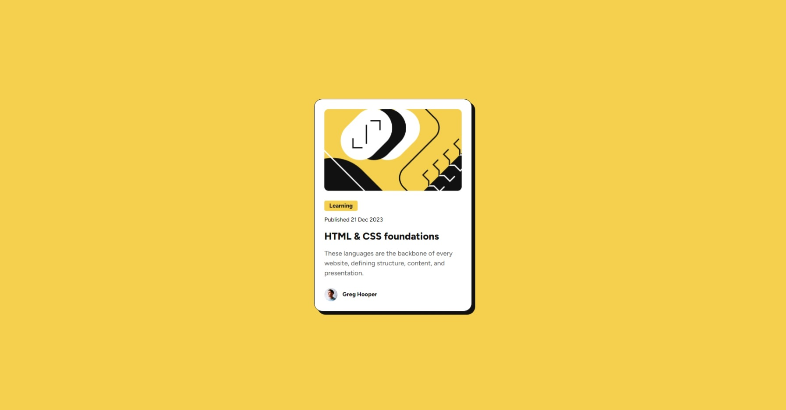

# blog-post

 blog-post card

This is a solution to the [Blog preview card challenge on Frontend Mentor](https://www.frontendmentor.io/challenges/blog-preview-card-ckPaj01IcS). Frontend Mentor challenges help you improve your coding skills by building realistic projects. 

### Built with

- Semantic HTML5 markup
- CSS custom properties
- Flexbox
- Mobile-first workflow

### What I learned

1) The use of max-width for responsiveness
2) Using 2 images, 1 for mobile and 1 for desktop and toggling between which one to appear based on the viewport width
3) Building mobile-first

